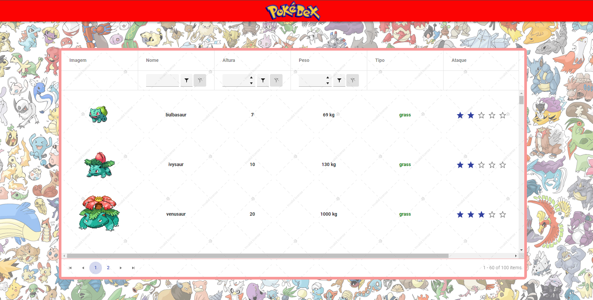

# Descrição da Aplicação - Feed Pokedex
A aplicação FeedPokedex é uma tela de feed feito com React + Kendo UI, utilizando o component Grid, que exibe informações detalhadas sobre diversos Pokémons, incluindo dados como nome, altura, peso, tipo, ataque, defesa e uma imagem representativa. A aplicação consome a API pública PokeAPI para obter informações atualizadas sobre os Pokémon e está hospedada no link https://pokedexhugo.netlify.app/.

## Características dos Pokémon Exibidos
- Imagem do Pokémon
  Exibição das imagens frontais padrão dos Pokémon.
- Nome do Pokémon
Nome do Pokémon é apresentado como uma referência identificadora.
- Altura:
Mostra a altura do Pokémon em uma unidade específica (provavelmente metros).
- Peso:
Exibe o peso do Pokémon em quilogramas.
- Tipo:
Apresenta o tipo primário do Pokémon, onde a cor do texto varia de acordo com o tipo.
- Ataque e Defesa:
Classificação do ataque e defesa do Pokémon, respectivamente, apresentados em um sistema de rating.

# Instruções de Execução e Instalação do Projeto
## Pré-requisitos

Node.js, npm e React devem estar instalados localmente.

## Instalação

Clone o repositório.

Navegue até o diretório do projeto.

Execute `npm install` para instalar as dependências.

## Execução

Execute `npm start` para iniciar a aplicação em modo de desenvolvimento.

Acesse a aplicação no navegador através do endereço http://localhost:3000.

# Pacotes Utilizados
- @progress/kendo-theme-material: Fornece estilos e temas para os componentes KendoReact.
- @progress/kendo-data-query: Utilizado para filtrar dados na grade KendoReact.
- @progress/kendo-react-grid: Componente de grade KendoReact para exibição de dados tabulares.
- @progress/kendo-react-inputs: Componente de Rating KendoReact para exibir classificações em forma de estrelas.
- axios: Biblioteca para fazer requisições HTTP.
- Jest: Biblioteca para testes.

# Execução de Testes

Os testes são configurados usando a biblioteca Jest.

Execute `npm test` para executar todos os testes disponíveis.

# Getting Started with Create React App

This project was bootstrapped with [Create React App](https://github.com/facebook/create-react-app).

## Available Scripts

In the project directory, you can run:

### `npm start`

Runs the app in the development mode.\
Open [http://localhost:3000](http://localhost:3000) to view it in your browser.

The page will reload when you make changes.\
You may also see any lint errors in the console.

### `npm test`

Launches the test runner in the interactive watch mode.\
See the section about [running tests](https://facebook.github.io/create-react-app/docs/running-tests) for more information.

### `npm run build`

Builds the app for production to the `build` folder.\
It correctly bundles React in production mode and optimizes the build for the best performance.

The build is minified and the filenames include the hashes.\
Your app is ready to be deployed!

See the section about [deployment](https://facebook.github.io/create-react-app/docs/deployment) for more information.

### `npm run eject`

**Note: this is a one-way operation. Once you `eject`, you can't go back!**

If you aren't satisfied with the build tool and configuration choices, you can `eject` at any time. This command will remove the single build dependency from your project.

Instead, it will copy all the configuration files and the transitive dependencies (webpack, Babel, ESLint, etc) right into your project so you have full control over them. All of the commands except `eject` will still work, but they will point to the copied scripts so you can tweak them. At this point you're on your own.

You don't have to ever use `eject`. The curated feature set is suitable for small and middle deployments, and you shouldn't feel obligated to use this feature. However we understand that this tool wouldn't be useful if you couldn't customize it when you are ready for it.

## Learn More

You can learn more in the [Create React App documentation](https://facebook.github.io/create-react-app/docs/getting-started).

To learn React, check out the [React documentation](https://reactjs.org/).

### Code Splitting

This section has moved here: [https://facebook.github.io/create-react-app/docs/code-splitting](https://facebook.github.io/create-react-app/docs/code-splitting)

### Analyzing the Bundle Size

This section has moved here: [https://facebook.github.io/create-react-app/docs/analyzing-the-bundle-size](https://facebook.github.io/create-react-app/docs/analyzing-the-bundle-size)

### Making a Progressive Web App

This section has moved here: [https://facebook.github.io/create-react-app/docs/making-a-progressive-web-app](https://facebook.github.io/create-react-app/docs/making-a-progressive-web-app)

### Advanced Configuration

This section has moved here: [https://facebook.github.io/create-react-app/docs/advanced-configuration](https://facebook.github.io/create-react-app/docs/advanced-configuration)

### Deployment

This section has moved here: [https://facebook.github.io/create-react-app/docs/deployment](https://facebook.github.io/create-react-app/docs/deployment)

### `npm run build` fails to minify

This section has moved here: [https://facebook.github.io/create-react-app/docs/troubleshooting#npm-run-build-fails-to-minify](https://facebook.github.io/create-react-app/docs/troubleshooting#npm-run-build-fails-to-minify)
